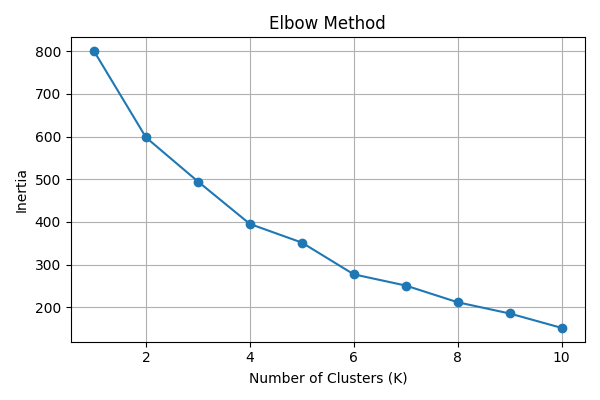
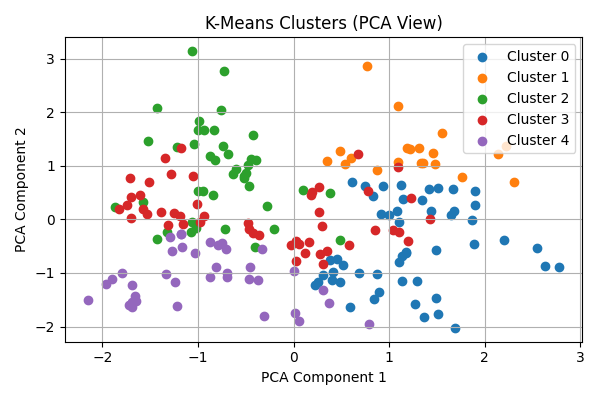

# 🧠 K-Means Clustering — Mall Customer Segmentation

## 📌 Objective
Perform unsupervised learning using K-Means clustering to identify distinct customer segments based on demographic and spending behavior.

---

## 📊 Dataset
- **Source**: Mall Customer Segmentation Dataset
- **Columns**:
  - `CustomerID`: Unique identifier (dropped)
  - `Gender`: Male/Female (encoded as 0/1)
  - `Age`: Customer age
  - `Annual Income (k$)`: Income in thousands
  - `Spending Score (1–100)`: Customer spending behavior
- **Preprocessing**:
  - Dropped `CustomerID`
  - Encoded `Gender` to numeric
  - Standardized features using `StandardScaler`

---

## 🛠 Tools Used
- Python
- Pandas, NumPy
- Scikit-learn
- Matplotlib

---

## 🧪 Workflow
1. Load and clean dataset
2. Standardize features
3. Use Elbow Method to find optimal number of clusters (K)
4. Fit K-Means and assign cluster labels
5. Evaluate clustering using Silhouette Score
6. Visualize clusters using PCA (2D projection)

---

## 📈 Screenshots

| Elbow Curve | Cluster Plot |
|-------------|--------------|
|  |  |

---

## 📦 How to Run

```bash
# Install dependencies
pip install pandas numpy matplotlib scikit-learn

# Run the script
python kmeans_clustering.py