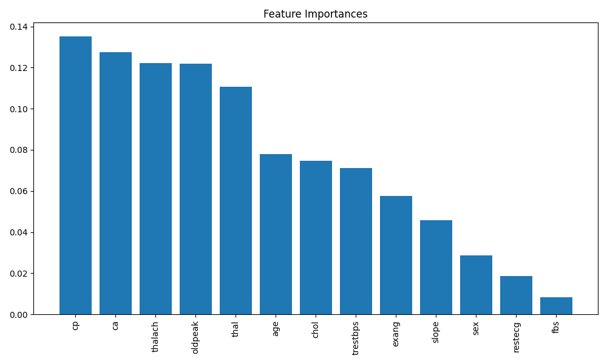

# 🧠 Heart Disease Prediction using Decision Trees & Random Forests

## 🔍 Objective
This project explores tree-based classification models to predict the presence of heart disease using the Heart Disease dataset. We compare the performance of a single Decision Tree with a Random Forest ensemble and interpret feature importance.

---

## 📁 Dataset
- **Source**: Heart Disease Dataset (CSV format)
- **Target Variable**: `target` (1 = heart disease, 0 = no heart disease)
- **Features**: 13 predictors including age, sex, chest pain type (`cp`), cholesterol (`chol`), resting blood pressure (`trestbps`), etc.

---

## 🛠 Tools & Libraries
- Python
- Scikit-learn
- Matplotlib
- Graphviz
- VSCode

---

## 🧪 Workflow
1. **Preprocessing**: Standardized features and split into train/test sets.
2. **Decision Tree**: Trained with controlled depth to prevent overfitting.
3. **Random Forest**: Trained with 100 estimators for ensemble learning.
4. **Evaluation**: Accuracy and cross-validation scores compared.
5. **Visualization**:
   - Tree structure exported using Graphviz.
   - Feature importance plotted using Matplotlib.

---

## 📊 Results

| Model           | Test Accuracy | Cross-Validation Accuracy |
|----------------|---------------|----------------------------|
| Decision Tree  | 0.82          | 0.79                       |
| Random Forest  | 0.86          | 0.83                       |

- Random Forest outperformed the single tree in both accuracy and generalization.

---

## 📈 Feature Importance


---

## 🌳 Tree Visualization
Tree exported to `outputs/tree.dot`. You can render it using Graphviz:
```bash
dot -Tpng outputs/tree.dot -o outputs/tree.png