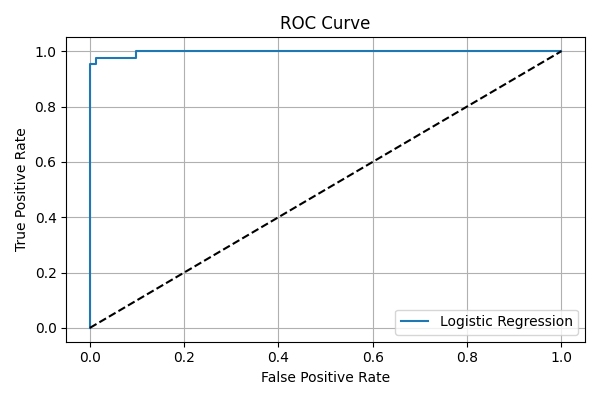
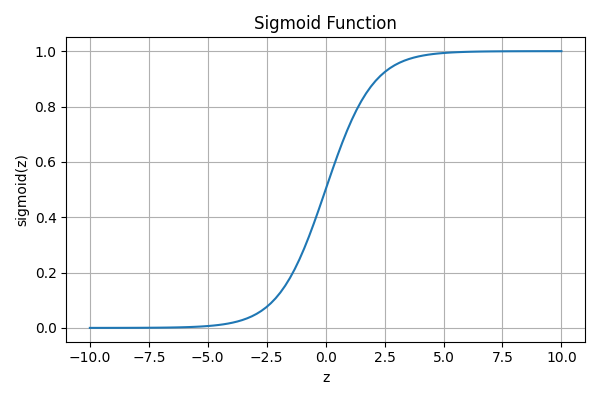

# 🧠 Logistic Regression Classifier — Breast Cancer Detection

## 📌 Objective
Build a binary classifier using logistic regression to predict whether a tumor is malignant or benign based on diagnostic features.

---

## 📊 Dataset
- **Source**: Breast Cancer Wisconsin Diagnostic Dataset
- **Format**: CSV file with 30 numeric features + diagnosis label
- **Target Column**: `diagnosis` (M = malignant, B = benign)
- **Preprocessing**:
  - Dropped `id` column
  - Converted `diagnosis` to binary (M → 1, B → 0)
  - Imputed missing values using mean
  - Standardized features using `StandardScaler`

---

## 🛠 Tools Used
- Python
- Pandas, NumPy
- Scikit-learn
- Matplotlib

---

## 🧪 Workflow
1. Load and clean dataset
2. Train/test split (80/20)
3. Impute missing values
4. Standardize features
5. Train logistic regression model
6. Evaluate using:
   - Confusion matrix
   - Precision, recall
   - ROC-AUC score
7. Tune classification threshold
8. Visualize sigmoid function

---

## 📈 Screenshots

| ROC Curve | Sigmoid Function |
|-----------|------------------|
|  |  |

---

## 📦 How to Run

```bash
# Install dependencies
pip install pandas numpy matplotlib scikit-learn

# Run the script
python logistic_classifier.py